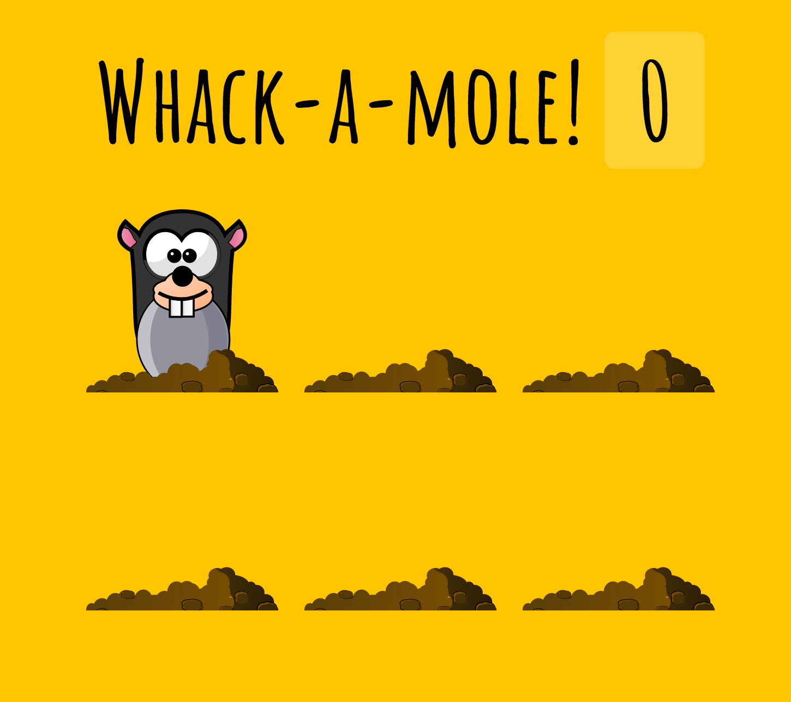

## JavaScript30 Day 30 - Whack A Mole

In this tutorial, we are going to learn to code a game called 'Whack A Mole'. When you run the game, you will see an animal popping up in random holes for a random amount of times. When you click them, you get a point as you follow with your mouse.

[View demo site here.](https://webdevtuts.github.io/javascript30_30/)

